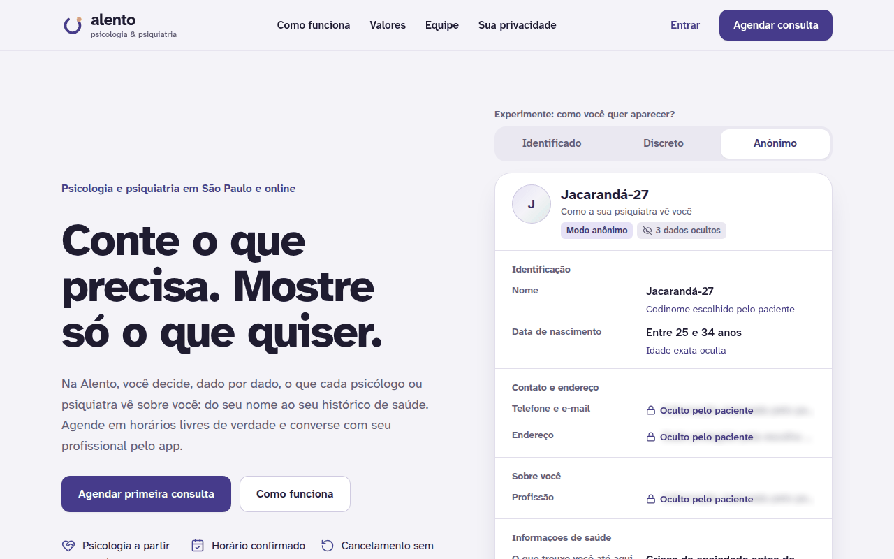
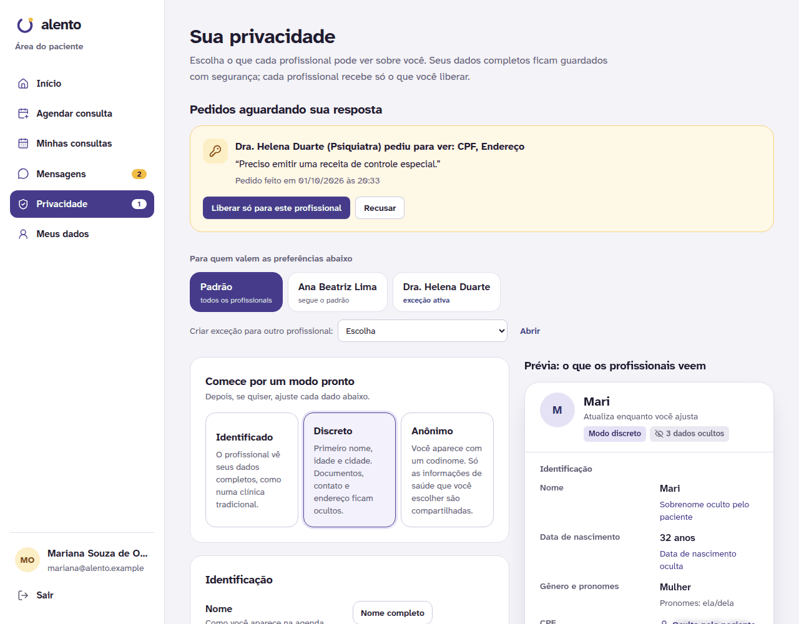
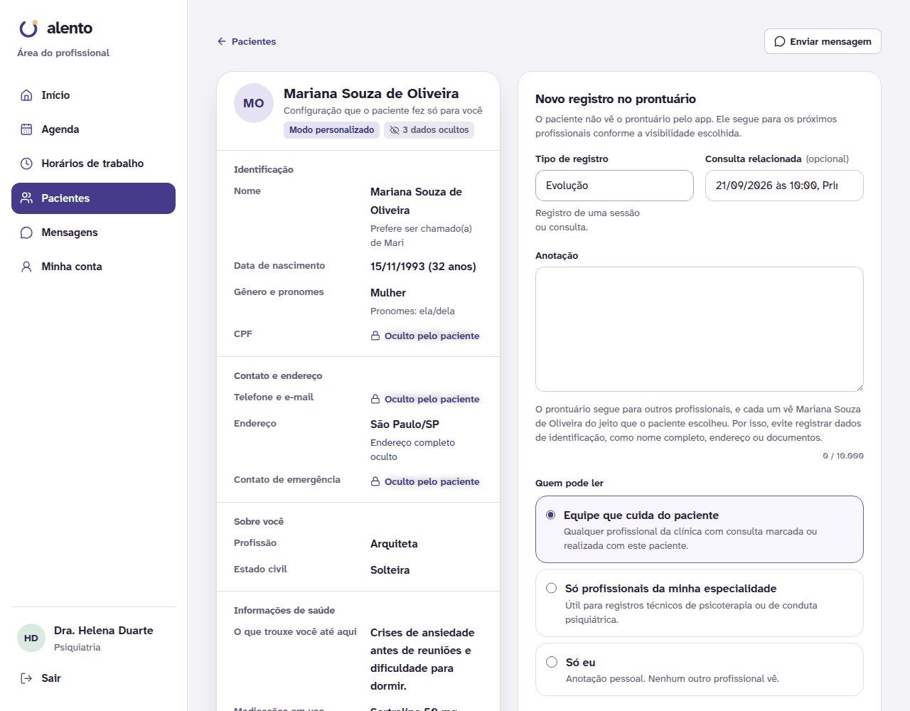
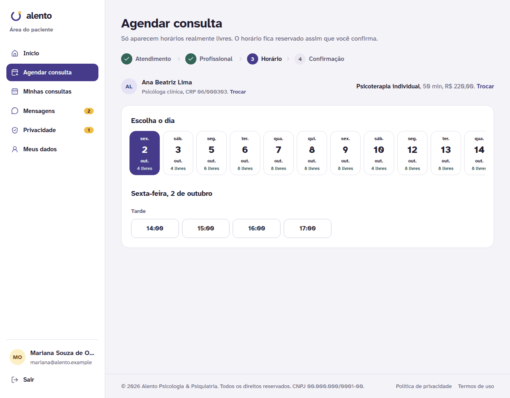
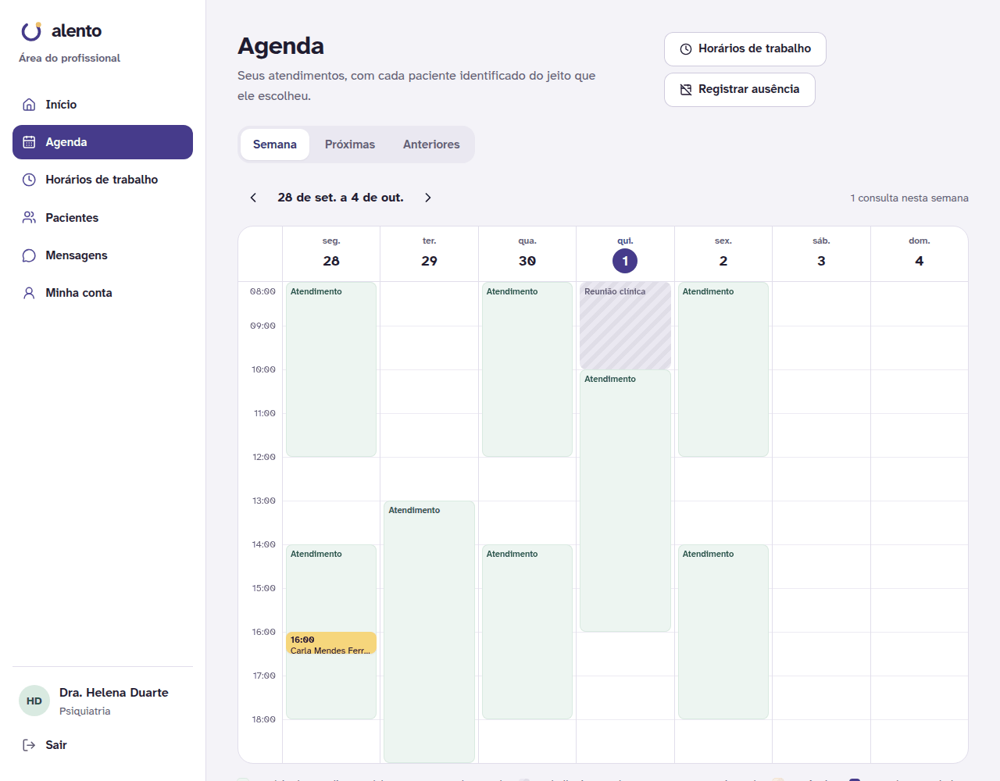
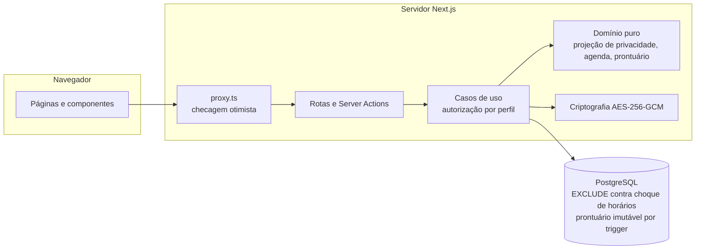

# Alento — Psicologia & Psiquiatria

Plataforma completa para uma clínica de psicologia e psiquiatria: site institucional, agendamento online, chat entre paciente e profissional, prontuário eletrônico e gestão da clínica, com um diferencial central, o **anonimato configurável**. O paciente decide, dado por dado, o que cada profissional pode ver sobre ele.



## O diferencial: anonimato configurável

- **O paciente escolhe como aparece**: nome completo, primeiro nome (ou nome social), iniciais ou um codinome (ex.: `Jacarandá-27`). Idade, contato, endereço, CPF, profissão e informações de saúde têm níveis próprios de exibição.
- **Modos prontos e ajuste fino**: *Identificado*, *Discreto* ou *Anônimo*, com ajuste campo a campo e **prévia ao vivo** do que o profissional vai ver.
- **Exceções por profissional**: por exemplo, mostrar o nome completo só para a psiquiatra que emite receitas.
- **Pedidos de acesso**: se o profissional precisa de um dado oculto, ele pede pelo app e explica o motivo; só o paciente aprova. A liberação vale só para os dados pedidos e só para quem pediu, fica listada na central de privacidade e pode ser revogada a qualquer momento.
- **O prontuário segue para o próximo profissional**: ele não aparece no app do paciente, mas fica disponível para os profissionais da clínica que cuidarem dele depois. Cada registro tem visibilidade (equipe do paciente, mesma especialidade ou só o autor) e notas de passagem de caso ficam fixadas no topo.
- **Transparência**: o paciente vê quem abriu seu perfil ou seu prontuário, e quando.
- **Por desenho, a administração não vê prontuários, dados de saúde nem mensagens**, e também não define nem vê senhas: ninguém da clínica consegue entrar como um profissional para ler o prontuário.

Os dados ocultos **nunca saem do servidor**: a tela do profissional recebe só a projeção permitida (a "névoa" na interface é um desenho com texto fictício). Detalhes em [docs/privacidade-e-anonimato.md](docs/privacidade-e-anonimato.md).

| Central de privacidade do paciente | Ficha e prontuário vistos pelo profissional |
| --- | --- |
|  |  |

## Funcionalidades

**Site público** (responsivo): página inicial com demonstração interativa do anonimato, *Como funciona*, *Valores* (vindos do cadastro de serviços), *Equipe*, perguntas frequentes, política de privacidade e termos de uso. Todas as páginas têm o aviso de direitos reservados e os contatos de crise (CVV 188 e SAMU 192).

**Paciente**
- Cadastro com escolha do modo de privacidade; edição dos próprios dados; "Esqueci minha senha" por e-mail.
- Agendamento em 4 passos: atendimento, profissional, dia e horário, confirmação. **Só aparecem horários realmente livres.**
- Minhas consultas, com cancelamento sem custo até 24h antes e botão para a sala online.
- Mensagens com cada profissional, com avisos automáticos de agendamento e cancelamento. Se o profissional cancelar, o paciente também recebe um e-mail discreto (sem nome do profissional nem motivo).
- Central de privacidade: modos, ajuste por campo, exceções por profissional, pedidos de acesso, liberações revogáveis, codinome e registro de acessos.

**Profissional** (psicólogo ou psiquiatra)
- Agenda em grade semanal e em lista, com o paciente sempre identificado do jeito que ele escolheu.
- Horários de trabalho: grade semanal com períodos de **atendimento** (abertos para agendamento) e de **trabalho interno** (supervisão, estudos), intervalo entre sessões, antecedência mínima e janela de agendamento.
- **Ausências e imprevistos**: bloqueia o período e, se quiser, cancela as consultas afetadas, avisando cada paciente pelo chat com o motivo.
- Cancelamento de consultas com motivo (o paciente recebe pelo chat) e registro de presença ou falta.
- Ficha do paciente (com anonimato) e prontuário imutável: anamnese, evolução, conduta medicamentosa (psiquiatria), encaminhamento e nota para o próximo profissional.

**Administração**
- Visão geral com indicadores (sem dados clínicos).
- Profissionais: cadastro com **convite por e-mail** (o profissional cria a própria senha), edição, reenvio de convite ou link de nova senha, desativação (cancela as consultas futuras e avisa os pacientes).
- Pacientes (apenas dados cadastrais), serviços e valores, agenda geral com cancelamento, trilha de auditoria e equipe administrativa.

| Agendamento: só horários livres | Agenda semanal do profissional |
| --- | --- |
|  |  |

## Arquitetura

Monólito modular em camadas, no estilo usado por equipes de produto: cada módulo de negócio é dono do seu domínio, dos seus casos de uso, das suas tabelas e da sua interface.

```
src/
├── app/                      # Rotas do Next.js (páginas finas que só compõem módulos)
│   ├── (site)/               #   site público: início, como funciona, valores, equipe, legal
│   ├── (auth)/               #   entrar (3 portais) e cadastro
│   ├── paciente/             #   área do paciente
│   ├── profissional/         #   área do profissional
│   ├── admin/                #   área administrativa
│   └── api/                  #   rotas HTTP (chat, contadores, saúde)
├── modules/                  # Módulos de negócio
│   ├── identity/             #   contas, sessões, perfis, portais
│   ├── privacy/              #   ★ motor de anonimato (campos, modos, projeção, pedidos)
│   ├── scheduling/           #   grade semanal, disponibilidade, agendamento, ausências
│   ├── clinical-records/     #   prontuário e regras de leitura
│   ├── messaging/            #   chat e avisos automáticos
│   ├── catalog/              #   serviços e valores
│   ├── administration/       #   gestão da clínica
│   └── audit/                #   trilha de auditoria (LGPD)
│       └── <módulo>/
│           ├── domain/          regras puras (testadas sem banco)
│           ├── application/     casos de uso (autorização + transações)
│           ├── infrastructure/  tabelas do módulo (Drizzle)
│           └── presentation/    Server Actions e componentes de tela
├── shared/                   # Infraestrutura comum (banco, criptografia), UI e utilitários
├── config/                   # Dados da clínica, navegação, regras operacionais
├── proxy.ts                  # Checagem otimista de sessão nas áreas logadas
└── instrumentation.ts        # Valida a configuração na inicialização
drizzle/                      # Migrações SQL (inclui regras de integridade no banco)
scripts/                      # Migração, dados de demonstração, primeiro administrador
tests/                        # Integração (PostgreSQL real) e ponta a ponta (Playwright)
docs/                         # Arquitetura, privacidade, LGPD e decisões (ADRs)
```



Mais em [docs/arquitetura.md](docs/arquitetura.md) e nas [decisões de arquitetura](docs/adr).

**Tecnologias:** Next.js 16 (App Router, Server Actions, Turbopack), React 19, TypeScript, Tailwind CSS 4, PostgreSQL 16, Drizzle ORM, Zod, Luxon, Vitest e Playwright.

## Como rodar localmente

Pré-requisitos: **Node.js 22.12+** e **Docker** (ou um PostgreSQL 16 próprio).

```bash
git clone <url-do-repositório> alento-clinica && cd alento-clinica
npm ci
cp .env.example .env
npm run generate:key          # cole a chave gerada em ENCRYPTION_KEY no .env
docker compose up -d          # PostgreSQL em localhost:5432 (já cria o banco de testes)
npm run db:setup              # aplica as migrações e cria os dados de demonstração
npm run dev                   # http://localhost:3000
```

Em desenvolvimento, sem `SMTP_URL`, os e-mails (convites, "esqueci minha senha", avisos) **aparecem no terminal** onde o `npm run dev` está rodando, e a tela da administração mostra o link do convite para você testar o fluxo. Para receber de verdade, configure `SMTP_URL` e `MAIL_FROM` no `.env`.

### Contas de demonstração

Senha de todas: **`Alento2026`**. Com `DEMO_MODE="true"`, elas aparecem na tela de entrada para entrar com um toque.

| Perfil | E-mail | O que mostrar |
| --- | --- | --- |
| Paciente | `mariana@alento.example` | Modo discreto, exceção para a psiquiatra e um pedido de acesso pendente |
| Paciente | `joao@alento.example` | Modo anônimo: aparece como `Jequitibá-41` |
| Paciente | `carla@alento.example` e `lucas@alento.example` | Modo identificado e modo discreto |
| Psiquiatra | `helena@alento.example` e `rafael@alento.example` | Agenda, prontuário e pedido de acesso |
| Psicóloga(o) | `ana@alento.example` e `thiago@alento.example` | Notas para o próximo profissional, agenda noturna online |
| Administração | `admin@alento.example` | Indicadores, profissionais, valores e auditoria |

> O seed **apaga** o banco antes de criar os dados. Por segurança, ele se recusa a rodar com `NODE_ENV=production`, em banco que não seja local (a não ser com `SEED_ALLOW_REMOTE=true`) e em banco que tenha contas fora do domínio de demonstração `@alento.example`. O próprio banco também bloqueia esvaziar o prontuário.

### Scripts

| Comando | O que faz |
| --- | --- |
| `npm run dev` / `build` / `start` | Desenvolvimento, build de produção e servidor de produção |
| `npm run check` | Formatação (Prettier) + lint + verificação de tipos + testes unitários |
| `npm run format` | Formata o código (Prettier) |
| `npm test` | Testes unitários (regras de domínio, sem banco) |
| `npm run test:integration` | Testes de integração com PostgreSQL real (usa `TEST_DATABASE_URL`, que é apagado) |
| `npm run test:e2e` | Testes no navegador (Playwright), computador e celular |
| `npm run db:migrate` | Aplica migrações pendentes |
| `npm run db:seed` | Recria os dados de demonstração |
| `npm run db:generate` | Gera migração a partir de mudanças nos schemas |
| `npm run admin:create` | Cria um acesso da administração (primeiro acesso em produção) |
| `npm run generate:key` | Gera uma `ENCRYPTION_KEY` |

## Testes

- **Unitários** (`src/**/*.test.ts`): projeção de privacidade, cálculo de horários livres (com fuso horário), políticas de cancelamento, regras de leitura do prontuário, senhas, criptografia, links de acesso, IP atrás de proxy e limites de tentativas.
- **Integração** (`tests/integration`): com o banco de verdade, provam por exemplo que:
  - o nome de um paciente anônimo não aparece em nada que o profissional recebe;
  - dois pacientes disputando o mesmo horário ao mesmo tempo resultam em uma única consulta;
  - paciente e administração não leem o prontuário, e o próprio banco impede alterar, apagar ou esvaziar registros clínicos;
  - a administração não consegue definir a senha de ninguém: profissionais entram só pelo convite enviado ao e-mail deles;
  - um pedido de acesso aprovado libera só os campos pedidos, continua valendo se o padrão mudar e pode ser revogado;
  - o paciente recebe o aviso de cancelamento pelo chat e por e-mail, sem o motivo nem o nome do profissional no e-mail.
- **Ponta a ponta** (`tests/e2e`): fluxos essenciais no navegador, em tela de computador e de celular.

A integração contínua (`.github/workflows/ci.yml`) roda tudo isso a cada push e pull request.

## Publicação (deploy)

Funciona em qualquer hospedagem de Node.js com PostgreSQL. Dois caminhos comuns:

1. **Vercel + PostgreSQL gerenciado** (Neon, Supabase, RDS…): importe o repositório na Vercel, configure as variáveis abaixo e rode `npm run db:migrate` apontando para o banco de produção.
2. **Docker** (Render, Railway, Fly.io, servidor próprio): `docker compose --profile app up --build` sobe banco, migrações e app; ou use as imagens do `Dockerfile` (alvos `runner` e `migrations`).

Variáveis de produção:

| Variável | Observação |
| --- | --- |
| `DATABASE_URL` | PostgreSQL 16+ com a extensão `btree_gist` disponível (padrão na maioria dos provedores) |
| `ENCRYPTION_KEY` | Gere com `npm run generate:key`. **Guarde em cofre de segredos e faça backup: sem ela os dados criptografados são irrecuperáveis.** |
| `APP_URL` | Endereço público do site |
| `DEMO_MODE` | `false` |
| `SMTP_URL` e `MAIL_FROM` | **Obrigatórios na prática**: sem eles, convites de profissionais, "esqueci minha senha" e avisos de cancelamento não são enviados. Use um domínio com SPF, DKIM e DMARC |
| `TRUSTED_PROXY_HOPS` | Quantos proxies confiáveis ficam na frente do app (padrão `1`). Não exponha o app sem um proxy reverso ou a própria hospedagem na frente |
| `NEXT_SERVER_ACTIONS_ENCRYPTION_KEY` | Recomendado com mais de uma instância |

Depois do primeiro deploy: `npm run admin:create -- --nome "Seu Nome" --email voce@clinica.com.br`.

### Antes de abrir para pacientes

- [ ] Trocar os dados de exemplo da clínica em `src/config/site.ts` (razão social, CNPJ, endereço, telefones e **responsável técnico com CRM e RQE**, exigido pela Resolução CFM nº 2.336/2023).
- [ ] Revisar a política de privacidade e os termos de uso com a assessoria jurídica; nomear o encarregado de dados (DPO).
- [ ] Definir o provedor de vídeo das consultas online (`ONLINE_MEETING_BASE_URL` em `src/config/clinic.ts`; o padrão usa salas do Jitsi Meet).
- [ ] Configurar o envio de e-mails (`SMTP_URL`, `MAIL_FROM`) e testar um convite e um "esqueci minha senha".
- [ ] Configurar backups do banco e da `ENCRYPTION_KEY`.
- [ ] Ajustar valores e serviços pela área administrativa.
- [ ] Trocar o nome do titular dos direitos em `LICENSE` e em `src/config/site.ts` pelo nome da sua empresa.

## Segurança e LGPD, em resumo

Sessões opacas no banco (cookie httpOnly, revogáveis), senhas com scrypt definidas só pelo dono da conta (convite e nova senha por links de uso único enviados por e-mail), limite de tentativas por conta e por IP, verificação de perfil em toda página, Server Action e rota, criptografia AES-256-GCM de dados de saúde, documentos e mensagens, prontuário imutável por trigger (nem `UPDATE`, nem `DELETE`, nem `TRUNCATE`), exclusão de choque de horários no próprio PostgreSQL, e-mails discretos, cabeçalhos de segurança e trilha de auditoria. Detalhes em [docs/lgpd-e-seguranca.md](docs/lgpd-e-seguranca.md) e nas decisões [0005](docs/adr/0005-links-de-acesso-por-email.md) e [0006](docs/adr/0006-liberacoes-por-campo.md).

> `npm audit` aponta alertas moderados apenas em dependências de desenvolvimento do `drizzle-kit` (esbuild do servidor de desenvolvimento). Eles não chegam à aplicação em produção.

## Licença

Copyright © 2026 Alento Psicologia & Psiquiatria. **Todos os direitos reservados.** Veja [LICENSE](LICENSE).
